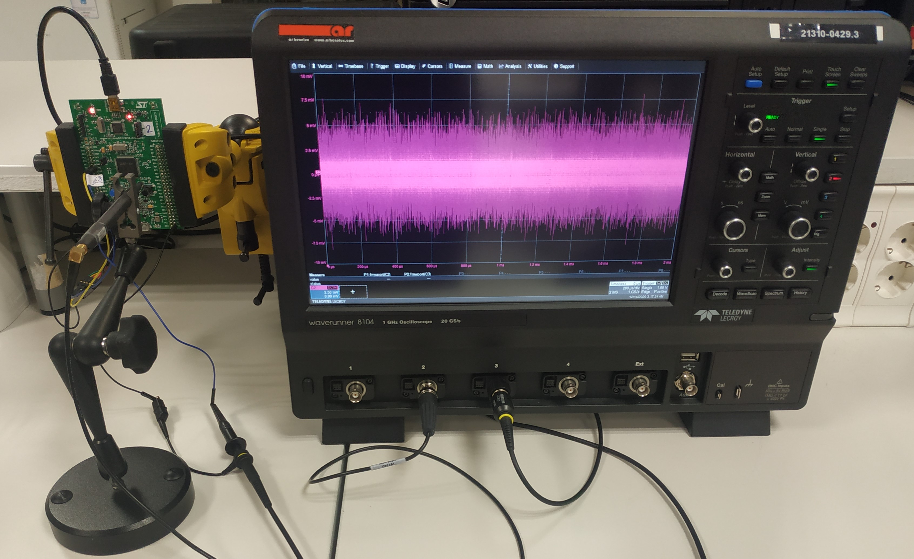
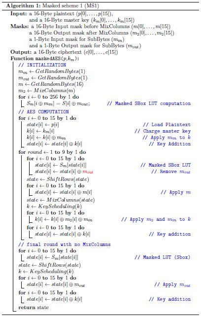
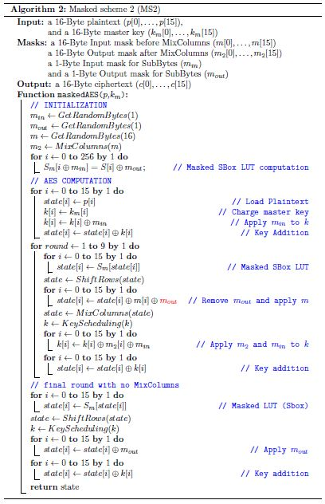
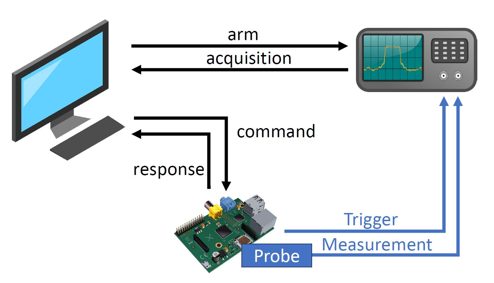
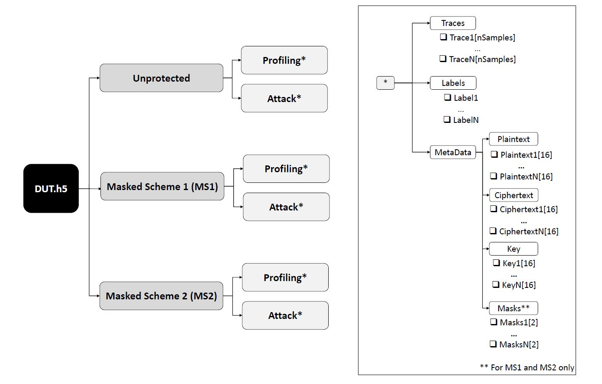

# *AES_PTv2* Dataset
This dataset contains power/EM traces from several devices executing three AES implementations: An unprotected AES implementation and two masked protected AES implementations (See AES implementation below). The goal is to provide realistic power/EM traces obtained from actual devices on the field, considering different AES implementations. In addition, we consider the portability issue by providing traces from different copies of the same hardware device. The devices under test are four identical copies of the same embedded device (STM32F4) and one different embedded device (Riscue Piñata). This results in 15 different setups.

## Introduction

Motivated by the lack of an open dataset for Side-channel analysis which includes traces from different copies of the same device and different AES implementations, we have generated the AES_PTv2 dataset (PT stands for portable). It includes EM traces from four copies of the same development board mounting an STM32F411VE high-performance Arm Cortex-M4 32-bit RISC microcontroller working at 100 MHz. 
The four copies are called D1, D2, D3, and D4 from now on. The dataset also includes clean power measurements from the Piñata board, a different embedded systems based on a microcontroller from the same family. 

## AES implementations

Three different AES software implementations have been considered. There is a brief explanation of each one of them is given in the sequel.

- **Unprotected AES** typical AES-128 (in ECB mode) software implementation [[2]](#2).

- **Masking Scheme 1 (Weak) - MS1:** A modification of the previous one which matches the same masking method as described in [[1]](#1) (Masked Lookup Table). In this implementation, the output mask of the SBox operation is removed after each 1-Byte lookup and hence we see a clear correlation of the mask in the SBox time window. This makes the scheme similar to the one used in ASCAD, as can be observed in its pseoudocode [[3]](#3). As we show in our experiments in [[5]](#5) and [[6]](#6), the close manipulation of the shares (i.e., mask and masked intermediate value) make this implementation vulnerable against PAs.

- **Masking Scheme 2 (Robust) - MS2:** A modification of the previous one, but this time the output mask is removed after the ShiftRows operation. This means that the output mask does not leak during the SBox computation, unlike in the previous scheme. Thus, there is no close manipulation of the shares, making the implementation secure against PAs.

Note that a second-order DPA attack, which combines the leakage of two bytes of the key at a time to remove the mask, is feasible in both MS1 and MS2. 
Below we show the pseudocode of MS1 and MS2 schemes.

## Targeted Boards

- **Piñata Board:** Piñata is a development board created by Riscure based on an ARM Cortex-M4F core working at a 168 MHz clock speed [[7]](#7). It has been physically modified and programmed to be a training target for SCA and Fault Injection. Essentially, the power line of the board has been kept readily accessible, and the decoupling capacitors on it have been removed, allowing very clean power consumption measurements. We measure the board's power consumption during the AES encryption with a Tektronix CT1 current probe attached to a 20 GS/s digital oscilloscope (LeCroy Waverunner 9104) triggered by the microcontroller, which raises a GPIO signal when the internal computation starts. Each power trace consists of 1,260 samples (1\,500 and 1\,800 for the masked implementations 1 and 2 respectively) taken at 1 GHz with 8-bit resolution, corresponding to the first SBox operation.

- **STM32F411E-DISCO Board:** The STM32F411E-DISCO is a development board with an STM32F411VE [[8]](#8) high-performance Arm Cortex-M4 32-bit RISC microcontroller working at 100 MHz. This board (STM32F411E-DISCO) is similar to Piñata (microcontrollers are from the same family), and uses exactly the same code. We measure the power consumption of the board during the AES encryptions with a Langer EM probe over a decoupling capacitor (C38) attached to the oscilloscope (LeCroy Waverunner 9104), wich again is GPIO-triggered by the microcontroller. This allows for a less invasive acquisition, but the traces are very noisy, which significantly complicates the attack. Each power trace consists of 1,225 samples (1,500 and 1,800 for the masked implementations 1 and 2 respectively).

## Acquisition specifications

The devices are encrypting 16-byte random plaintexts using the three software AES implementations described above. During that operation, we measure the power consumption of the device with a Langer EM probe attached to a 20 GS/s digital oscilloscope (LeCroy Waverunner 9104) triggered by the microcontroller, which rises a GPIO signal when the internal computation starts. The high sensibility probe is placed over a decoupling capacitor connected to the power line of the device. The traces are taken at 1 GHz with 8-bit resolution, corresponding to the first Sbox operation. Traces are preprocessed by applying zero mean, standardization, waveform realignment, and a lightweight software low-pass filter. Nevertheless, traces are deliberately quite noisy (due to the nature of EM measurements, variations during the acquisition of the traces, constructive differences between the devices, etc.) to serve as realistic experimental use cases. 

## Dataset organization
The dataset is stored using the HDF5 format. It is divided in 5 separate files, one pear each device: Pinata.h, D1.h, D2.h, D3.h and D4.h. Each HDF5 file is organized as is illustrated in the figure below. In the figure, DUT.h represent the device (namely Pinata, D1, D2, D3 or D4). Thus, fore each device, the file has 3 subgroups as it includes traces of the device performing operations with the three aforementioned AES implementations. Each group is divided in two soubgroups: Profiling (random keys) and Attack (fixed keys). In turn, each subgroup is divided in more subgroups containing the traces, labels and metadata of the traces.

Regarding the number of traces, the dataset includes 600,000 traces per device:
	- 150,000 unprotected AES power traces (100,000 traces of the device using random keys and 50,000 traces of the device using a fixed key).
	- 200,000 MS1 power traces (150,000 traces of the device using random keys and 50,000 traces of the device using a fixed key).
	- 300,000 MS2 power traces (200,000 traces of the device using random keys and 100,000 traces of the device using a fixed key).
	
## Download
The dataset can be downloaded from the following links:
- [Piñata](https://drive.google.com/file/d/1n8KQuq-giq2ZJvCLzBL_L-2zlq-nDk-q/view?usp=sharing) 
- [STM32F4-D1](https://drive.google.com/file/d/1xDY3-xJ2GodaY2-qgsKm1_LrH7GxkIcr/view?usp=sharing)
- [STM32F4-D2](https://drive.google.com/file/d/1FLNX9h957BgaR0Op1-ZR8X7xweTxqACm/view?usp=sharing)
- [STM32F4-D3]()
- [STM32F4-D4]()
	
## Previous datasets

This dataset is (partially) created from two previous datasets: 

- AES_PT: introduced in "Auto-tune POIs: Estimation of distribution algorithms for efficient side-channel analysis" [[4]](#4) published in the "Computer Networks" journal in 2021. This dataset contains the traces from D1, D2, D3, and D4 implementing unprotected AES and AES MS2.

- AES_RA: introduced in "Towards Human Dependency Elimination: AI Approach to SCA Robustness Assessment" [[5]](#5) preprint published in the "Cryptology ePrint Archive" in 2021. AES_PTv2 piñata traces implementing unprotected AES, AES MS1, and AES MS2 came from this dataset.

In addition, we performed a new acquisition of traces from D1, D2, D3, and D4 implementing AES MS1 to complete the dataset. Note that in AES\_PT (the first version, [[4]](#4)), the masking scheme used is MS2, which, as mentioned above, is robust against first-order attacks. 
However, the work in [[4]](#4) was limited to introducing the method at a very early stage. Thus, some crucial concepts such as the generalization of the obtained templates or the close manipulation of the shares (i.e., mask and masked intermediate value) in masking protected implementations, were not taken into account. This means we could find a model that works on a small set of traces, but the model does not work under more realistic conditions. This phenomenon can be observed in the boxplots representing the output of the attacks in [[6]](#6). Both EDA and DL methods manage to obtain low guessing entropy final values in some attacks, but the average attack is not successful. 
Consequently, in [[5]](#5) we improve the method by taking into account the generalization of the templates and the close manipulation of the shares, motivating the creation AES_RA (and eventually AES_PTv2). As can be seen in [[5]](#5) and [[6]](#6), our (improved) EDA-based approach represent a very efficient and user-friendly shortcut that can be employed to distinguish whether a masking scheme has been correctly implemented (like MS2) or not (like MS1).

## References

<a id="1">[1]</a> 
S. Mangard, E. Oswald, T. Popp,
"Power Analysis Attacks: Revealing the Secrets of Smart Cards".,
Springer, 2007.

<a id="2">[2]</a> 
Small portable AES-128 in C.,
https://github.com/bitdust/tiny-AES128-C

<a id="3">[3]</a> 
Ryad Benadjila, Emmanuel Prouff, Rémi Strullu, Eleonora Cagli, and Cécile
Dumas. 
"Deep learning for side-channel analysis and introduction to ASCAD
database". 
In: Journal of Cryptographic Engineering 10 (June 2020).

<a id="4">[4]</a> 
Unai Rioja, Lejla Batina, Jose Luis Flores, and Igor Armendariz. 
"Auto-tune POIs: Estimation of distribution algorithms for efficient side-channel analysis".
In: Computer Networks 198 (2021), p. 108405.

<a id="5">[5]</a> 
Unai Rioja, Lejla Batina, Igor Armendariz, and Jose Luis Flores. 
"Towards Human Dependency Elimination: AI Approach to SCA Robustness Assessment".
IACR Cryptol. ePrint Arch., Report 2021/1316, 2021.

<a id="6">[6]</a> 
Unai Rioja, Lejla Batina, Igor Armendariz, and Jose Luis Flores. 
"Keep It Unbiased: A Comparison Between Estimation of Distribution Algorithms and Deep Learning for Human Interaction-Free Side-Channel Analysis". 
2021. arXiv: 2111.13425 [cs.CR].

<a id="7">[7]</a>
Riscure. Piñata board brochure. https://www.riscure.com/uploads/2017/07/pi%C3%B1ata_board_brochure.pdf

<a id="8">[8]</a>
STMicroelectronics. STM32F411VET6 Datasheet. 
https://www.alldatasheet.com/datasheet-pdf/pdf/929991/STMICROELECTRONICS/STM32F411VET6.html. 
